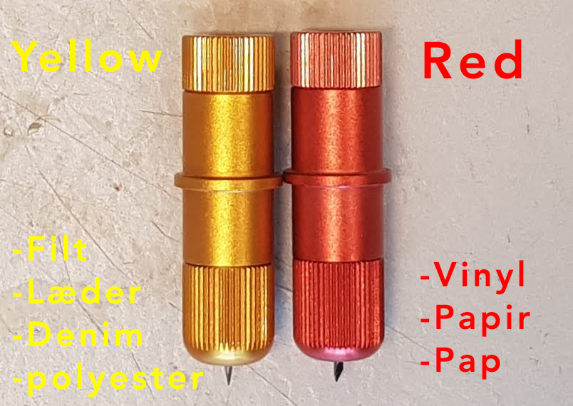
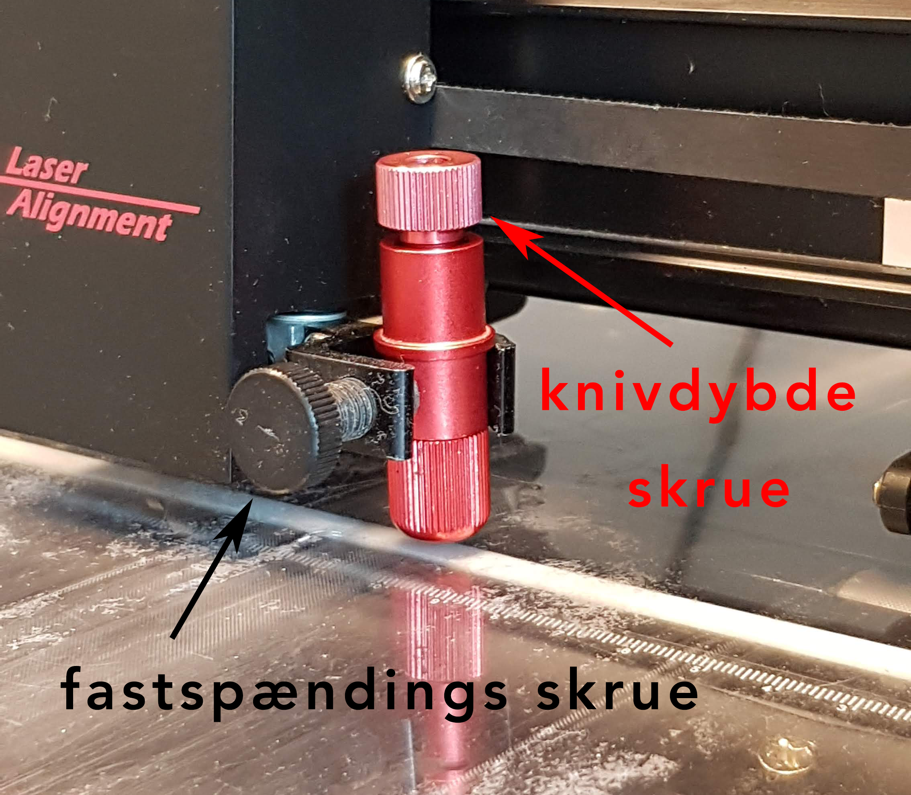
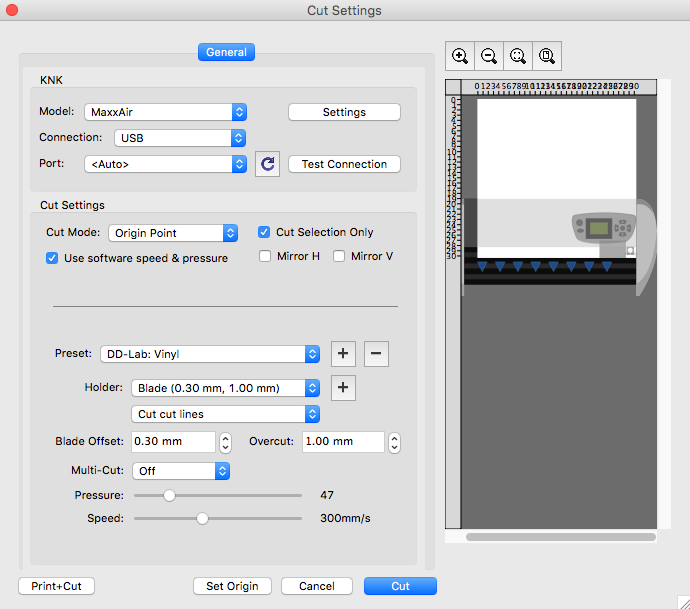

# Vinylcutter i DD Lab

## Brug af Vinylcutter i DD Lab

Før du går igang med at bruge vinylcutteren er det vigtigt at du har sat dig godt ind i hvordan den virker. Det kan du læse om i denne guide.

Hvis der skulle være noget du er i tvivl om i forhold til brugen af vinylcutteren, så kontakt en ansat i DDLab, enten i åbningstiden eller på mail.

## Inden du går igang

Inden du går i gang, er her et par ting, der er smarte at huske på:

- Inden du skærer med vinyl-cutteren skal du flytte den lidt ud fra væggen.
- Et godt cut afhænger af rigtig mange faktorer: knivens dybde, hvor jævnt papiret er placeret, hvilken type vinyl og hvor meget force der er indstillet.
- Vinylcutteren har et effektivt skæreområde på 700x260mm.

*Hvis du gør dig egne erfaringer med at bruge vinylcutteren, så giv dem meget gerne videre til labbet og dine øvrige medstuderende.*

## Anbefalede Cut Settings for forskellige materialetyper

Alt afhængig af hvilket materiale du bruger skal du bruge de korrekte blade, force, speed, osv.

I linket [her](https://www.iloveknk.com/Support/Settings/Suggested-MaxxAir-Settings.pdf) kan du finde alle de bedste cut-settings for forskellige materialer.

| Material Type                             | Material Brand or Source                                     | Blade | Force (f) | Speed (v) | # of Passes | Other Comments                                               |
| ----------------------------------------- | ------------------------------------------------------------ | ----- | --------- | --------- | ----------- | ------------------------------------------------------------ |
| Vinyl (BIC Velleda - Adhesive-Whiteboard) | https://www.amazon.co.uk/Velleda-50cm-Adhesive-Whiteboard-Roll/dp/B001AO18OW | Red   | 47-56     | 220       | 1           | Afhængig af hvor komplex en form man skærer skal man bruge mere eller mindre **Force** |

_______

## Sådan bruger vinylcutteren

1. Design din figur i [SCAL(sure cuts a lot)](http://surecutsalot.com/software/software_scal.html)!

   2. For at kunne lave noget man kan skærer på vinylcutteren, skal man bruge softwaret [SCAL(sure cuts a lot)](http://surecutsalot.com/software/software_scal.html). Det kan bruges fra Computeren der er placeret over vinylcutteren.

      - Du logger ind på computeren med koden "ddlab".
      - Åbner SCAL, og designer din fil.

   

2. Når du er klar til at skære:

   1. Skær et stykke vinyl ud.

      

3. Placer dit valgte materiale (vinyl) på matten i vinylcutteren.

   1. Brug "easy-tac" eller "ReMount"-adheisive spray på emnet, og klæb det fast på matten.

      **Vigtigt: Brug kun adhesive-spray lim der kan fjernes igen!!!**

      

   2. Brug rullen, til at presse emnet ned mod matten, og fjerne luftebobler, så det klæber sig fast på vinylcutterens mat.

      

4. Vælg det korrekte blad i forhold til materiale (hvis det er vinyl så vælges den røde kniv).

   

   4. Kniven monteres da i vinylcutteren, og knivens dybde indstilles.

      

      1. Knivens spids skal kun lige nøjagtigt røre ved matten der ligger under vinyl-emnet.

         

      Nu er maskinen klar til at skære i dit valgte stykke vinyl.

   5. Herefter klikker du på "cutter" inde i SCAL softwaret på computeren.

   

   1. I Cut settings skal du indstille på følgende måde (som vist):

      1. Cut Mode: Origin Point.
   2. Enable: Cut selection only.

   2. Hvis du skal skære i vinyl du har fået i DD-lab, Så vælg preset: "DD-lab: Vinyl".

   1. DD-Lab: Vinyl = v: 220, f:59, multicut:0.

   3. Hvis du skærer i et andet materiale så skal du manuelt indstille:

      - speed(v), 

      - force(f), 

      - multicut

   4. Set Origin (hvor på dit emne skal figuren skæres ud)

      

      1. For at flytte origin bruger man piletasterne på den tilsluttede computer for at ændre X og Y positionen.
      2. Positionen kan flyttes hurtigere ved at holde "shift" + piletast eller langsommere med "cmd"+piletast.
      3. Når du er tilfreds med positionen trykker du "OK".

   5. Når du er klar til at skære, tryk på "Cut".

5. Efter at du har skåret din figur ud med vinylcutteren skal der ryddes op.

   1. Fjern dit fastspændte vinyl fra vinylcutteren.

   2. Rester fra adhesive-spray skal fjernes med klud, alkohol og kno-fedt.

      1. Fjern matten fra vinylcutter før rengørring.

      

   3. Kniven afmonteres og alt grej opryddes og kommes i den gule vinylcutter kasse.

   4. Skub vinylcutteren tilbage ind under computeren.

## Sources:

- https://www.doityourself.com/stry/cellulose-adhesive (fjerne spray lim)
- https://www.iloveknk.com/0um/MaxxAir-with-MTC/KNKMaxxAir-with-MTC-UM.pdf
