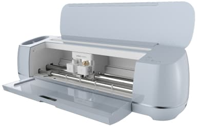

# Vinylskærer i DDlab
 
I labbet er det muligt at bruge vinylskærer til skære vinyl ud eller til at printe og skære klistermærker
  

<h2>Tilgængelige måtter</h2>

<b>LightGrip</b>  
til lette materialer som printerpapir, tyndt karton eller vellum. Holder fast uden at rive.
  
<b>StandardGrip</b>  
til almindelige materialer som karton, vinyl og jern-på-folie. Den mest brugte “allround” måtte.
  
<b>StrongGrip</b>  
til tunge eller meget stive materialer som kraftigt karton, glitterkarton, chipboard eller træfinér.
  
<b>FabricGrip</b>  
specielt til stof. Bruges sammen med stofklinger, holder stoffet fast uden at ødelægge fibrene.
  

[Mat Guide (officiel)](https://cricut.com/blog/which-cricut-mat-should-you-use/)
