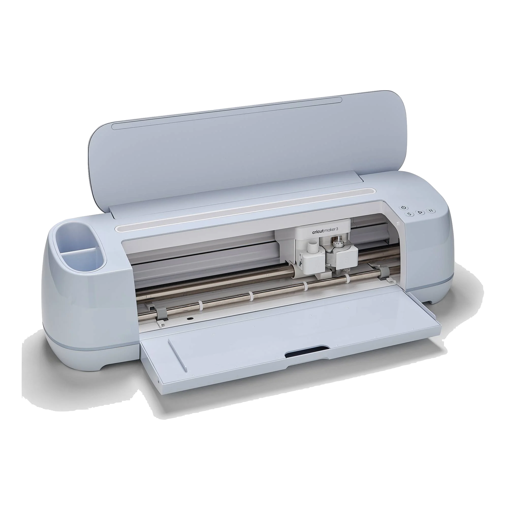

<html lang="da">
<head>
  <meta charset="utf-8" />
  <meta name="viewport" content="width=device-width, initial-scale=1" />
  <title>Vinylskærer i DDlab — Liquid Glass</title>
  
</head>
<body>
  

  

    <main>
      <header class="hero">
        
        <h1>Cricut Maker 3</h1>
        
DD Lab · Vinylskærer

      </header>

      <section id="intro" class="box glass accent-green">
        

          Cricut Maker 3 er en avanceret skæremaskine, der kan håndtere mere end 300 forskellige materialer – fra tyndt papir og vinyl til stof, læder og tyndt træ. Den giver dig mulighed for at lave alt fra simple klistermærker til komplekse prototyper med høj præcision.
           Maskinen kan både skære, præge, gravere og ridse, og med funktionen <b>print‑then‑cut</b> kan du printe dine egne designs og derefter få dem skåret ud i perfekte konturer.
           Alt styres gennem softwaren <b>Design Space</b>, hvor du kan uploade dine egne filer eller bruge færdige skabeloner.
            Det gør Cricut Maker 3 til et fleksibelt værktøj – uanset om du vil lave kreative projekter, personlige gaver eller eksperimentere med nye materialer i værkstedet.
            Maskinen kan findes i DD Lab (kan ikke lånes ud). Spørg en DD Lab ansat om hjælp, for hurtigere at komme i gang.
        

        

          <a class="chip glass" href=" https://www.youtube.com/watch?v=S_hH581tj6M" target="_blank" rel="noopener">Start med denne video</a>
        

      </section>

      <section id="mats" class="box glass accent-blue">
        <h2>Tilgængelige måtter</h2>
        
<b>LightGrip</b> til lette materialer som printerpapir, tyndt karton eller vellum. Holder fast uden at rive.

        
<b>StandardGrip</b> til almindelige materialer som karton, vinyl og jern‑på‑folie. Den mest brugte “allround” måtte.

        
<b>StrongGrip</b> til tunge eller meget stive materialer som kraftigt karton, glitterkarton, chipboard eller træfinér.

        
<b>FabricGrip</b> specielt til stof. Bruges sammen med stofklinger, holder stoffet fast uden at ødelægge fibrene.

        
<a class="chip glass" href="https://cricut.com/blog/which-cricut-mat-should-you-use/" target="_blank" rel="noopener">Mat Guide (officiel)</a>

        
      </section>

      <section id="general" class="box glass accent-orange">
        <h2>Generelt for alle måtter</h2>
        <ul>
          <li>Læg altid det gennemsigtige beskyttelsesark på efter brug, så de ikke samler støv.</li>
          <li>Brug en skraber til at fjerne små stykker papir/vinyl og en spatel til at løfte tingene nænsomt af.</li>
          <li>Undgå fingre på klæben – fedt fra huden ødelægger limen.</li>
          <li>Rens forsigtigt med en fnugfri klud og evt. lidt mildt vand (ikke sæbe eller sprit).</li>
          <li>Læg aldrig måtten i direkte sol eller varme – klæben kan tørre ud.</li>
        </ul>
      </section>

      <section id="specific" class="box glass accent-purple">
        <h2>Specifikt for hver måtte</h2>
        <dl>
          <dt>LightGrip</dt>
          <dd>Pas på at materialer ikke løsner sig midt i skæringen (især tyndt papir). Sørg for at glatte det godt fast.</dd>
          <dt>StandardGrip</dt>
          <dd>Kan være lidt for stærk til meget tynde materialer – her risikerer man, at papiret flosser, når man tager det af.</dd>
          <dt>StrongGrip</dt>
          <dd>Klæben er meget kraftig – brug ofte malertape eller maskeringstape rundt i kanterne, så materialet sidder ekstra fast. Vær forsigtig, når du fjerner materialet, ellers kan det knække.</dd>
          <dt>FabricGrip</dt>
          <dd>Brug kun til stof og med den rigtige klinge (rotary blade). Undgå at bruge papir eller vinyl på den.</dd>
        </dl>
      </section>

      <section id="materiale" class="box glass accent-teal">
        <h2>Materiale</h2>
        
Vi har som regel forskellige typer akryl og papir til rådighed. Da vi udelukkende anvender officielle og bedst egnede materialer, er de desværre for dyre til at kunne tilbydes gratis. Derfor skal der betales for materialer i forbindelse med projekter – både undervisningsrelaterede og fritidsprojekter.

        
<a class="chip glass" href="https://auwebshop.au.dk/udstyr/materialer" target="_blank" rel="noopener">Betal inde på vores Webshop</a>

        <h3>Self anskaffet materiale</h3>
        
Det er muligt selv at skaffe materiale, da brugen af maskinen er gratis. Det kræver at man køber kompatibelt materiale af officiel udbyder (eller tilsvarende høj kvalitet).

        
Tjek eventuelt: <a class="chip glass" href="https://www.elgiganten.dk/computer-kontor/printere-kontor/digital-skaremaskine" target="_blank" rel="noopener">Elgiganten</a> <a class="chip glass" href="https://makerstudio.dk/alt-til-cricut-joy_163" target="_blank" rel="noopener">makerstudio</a>

        
        <h3>Eksempler på materialer</h3>
        
<b>Smart akryl</b> (permanent) Selvklæbende vinyl med stærk lim, beregnet til langtidsholdbare projekter. Tåler vand og sollys og bruges fx på glas, metal, plastik og skilte.

        
<b>Smart akryl (flytbar)</b> Ligner den permanente version, men med en mildere lim. Kan fjernes uden at efterlade mærker.

        
<b>Smart papir</b> Klæbende bagside, så du kan skære og sætte direkte på projektet uden lim. Bruges til kort, scrapbooking eller klistermærker.

        
<b>Smart papir (transparent / vandfast)</b> En klar, vandafvisende variant af smart papir – perfekt til etiketter, glas eller udendørs brug.

        
<b>Iron‑on (varmeoverførsel / HTV)</b> Materiale der overføres med varme på stof, tekstiler eller poser. Fås i mange farver, metallic eller glimmer.

        <h4>Flere materialer Cricut Maker 3 kan bruge:</h4>
        
Karton og papir (almindelig, glimmer, kraft) 
        Stof (med backing) 
        Læder og imiteret læder 
        Balsatræ og finer 
        Skumark (foam) 
        Vinyl (ikke‑smart, bruges med måtte) 
        Transfer tape (til at flytte udskårne designs)

        <h3>Materialer på lager</h3>
    
<em>Udvalget kan variere i den nærmeste tid, da vi tester forskellige typer.</em>

    <ul>
    <li>Almindeligt A4-klistermærkepapir</li>
    <li>A4-klistermærkepapir, vandfast og skinnende</li>
    <li>A4-klistermærkepapir, vandfast, skinnende og transparent</li>
    <li>A4-klistermærkepapir, vandfast og transparent</li>
    <li>A4-klistermærkepapir, vandfast og hvidt</li>
    <li>Vinylruller i forskellige farver — både permanent og flytbar</li>
    </ul>
      </section>

      <section id="software" class="box glass accent-indigo">
        <h2>Software</h2>
        
Hent software for at komme i gang med Vinylcutter'en. Den rigtige version er: <b>"Cricut Maker 3"</b>

        
De essentielle funktioner er GRATIS. Der er add‑ons og in‑app purchases, dem skal I som udgangspunkt se bort fra.

        
<a class="chip glass" href="https://design.cricut.com" target="_blank" rel="noopener">https://design.cricut.com</a>

        <h4>Links</h4>
        
<a class="chip glass" href="https://help.cricut.com/hc/en-us/articles/1500007912041-All-About-Smart-Materials" target="_blank" rel="noopener">All about smart materials</a>

        
<a class="chip glass" href="https://help.cricut.com/hc/en-us/articles/360009387274-How-to-Print-Then-Cut-in-Design-Space" target="_blank" rel="noopener">Print‑Then‑Cut (klistermærker)</a>

      </section>

      <section id="inspiration" class="box glass accent-indigo">
        <h2>Inspiration</h2>
        
<a class="chip glass" href="https://www.youtube.com/@Cricut/videos" target="_blank" rel="noopener">https://www.youtube.com/@Cricut/videos</a>

        
<a class="chip glass" href="https://help.cricut.com/hc/en-us/articles/360061650414-How-to-use-the-Offset-feature-in-Design-Space" target="_blank" rel="noopener">Tilføj offset/outline til dit design</a>

        <h4>Formål</h4>
        
Skær illustrationer af grænseflader ud i smart‑papir eller vinyl – fx knapper, ikoner og overlays, du kan flytte rundt på skærmmockups, whiteboards eller fysiske modeller.

        
Kombinér Cricut‑skårne dele (pap, akryl, tyndt træ) med Arduino, MakeyMakey eller sensorer, så du får små, klikbare brugerflader.

        
Skær logos, skiltning, stickers og etiketter til installationer, udstillinger eller projektdemoer.

        
Mere på vej. Har du fundet eller selv skabt noget godt? Send det til os :)

      </section>
    </main>

    <!-- RIGHT SIDEBAR NAV -->
    <aside aria-label="Menu" class="glass toc">
      <h3>Navigation</h3>
      <a href="#top">Top</a>
      <a href="#mats">Tilgængelige måtter</a>
      <a href="#general">Generelt</a>
      <a href="#specific">Specifikt pr. måtte</a>
      <a href="#materiale">Materiale</a>
      <a href="#software">Software</a>
      <a href="#inspiration">Inspiration</a>
    </aside>
  

  
</body>
</html>
